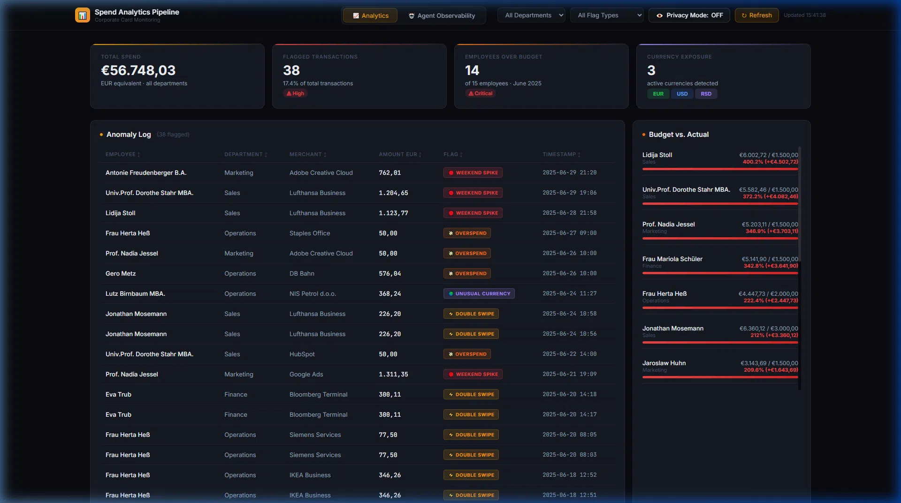
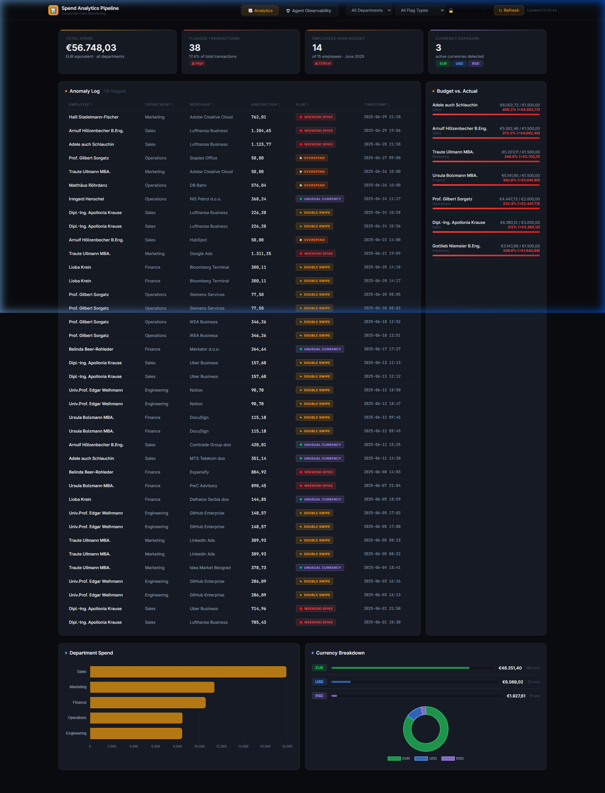
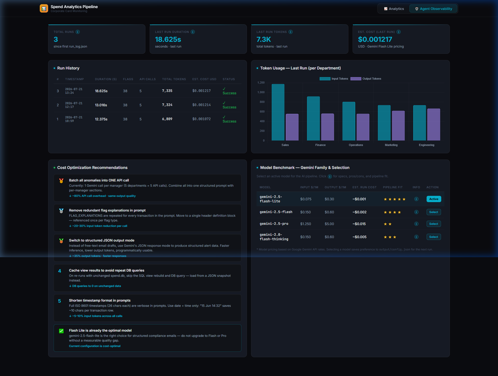

# Corporate Spend Analytics & AI Observability Pipeline

> **The Problem**: At the end of every month, finance teams spend **2 to 3 hours** reviewing hundreds of corporate card transactions, identifying policy violations, and writing custom email notifications to department managers.
> 
> **The Automation**: This pipeline completes the entire process — from raw card data to fully drafted, personalized compliance emails — in **under 15 seconds** for **$0.001 per run** (less than 1/10th of a cent).
> 
> **The Governance**: Automation without visibility creates hidden software costs. This system includes a dual-layer dashboard that tracks every single AI operation, logging exact token usage, execution time, and dollar cost, while serving prioritized recommendations on how to further reduce API expenses.

---

## Key Business Benefits

| Metric | Manual Process | Automated Pipeline | Improvement |
|---|---|---|---|
| **Processing Time** | 2 – 3 Hours | 12.3 Seconds | **99.8% Faster** |
| **Monthly Labor Cost** | ~$150 – $250 (Analyst time) | $0.03 (20 daily runs) | **99.9% Savings** |
| **Anomaly Detection** | Manual filter / sampling | 100% automated coverage | **Zero Missed Flags** |
| **AI Cost Transparency** | Opague API bills | Real-time token & cost tracking | **Full Observability** |

---

## Dashboard Preview



---

## Two-Layer Web Dashboard

The application ships with a zero-dependency local web dashboard operating on two distinct layers:

### 1. Analytics Layer (Tab 1)
Designed for finance operations and department heads:
- **KPI Summary Cards**: Real-time total spend, anomaly rates, budget overspend count, and currency exposure.
- **Filterable Anomaly Log**: Interactive table flagging 4 specific anomaly types with detailed transaction popups.
- **Department & Budget Heatmaps**: Visual tracking of budget allocation vs. actual spend per employee.
- **Multi-Currency Breakdown**: Automated tracking of EUR, USD, and unexpected foreign currencies.
- **GDPR Privacy Mode (🔒)**: Interactive toggle button to instantly blur employee PII for safe screen-sharing and demo meetings.



### 2. Agent Observability Layer (Tab 2)
Designed for operations managers and system admins:
- **Run History Ledger**: Execution times, total processed flags, and total API call counts.
- **Token Breakdown**: Visual stacked chart tracking prompt (input) vs. candidate (output) tokens per department.
- **Dynamic Model Switcher & Benchmarks**: Compare Gemini 2.5 Flash Lite, Flash, Pro, and Thinking models with interactive `ⓘ` popovers and select active models on the fly.
- **Live Cost Estimation**: Real-time dollar tracking based on Gemini API pricing models.
- **Contextual Tooltips (`ⓘ`)**: Educational popovers explaining what happens in each run, comparing machine execution against human hours, and mapping token counts to word volumes.



---

## Architecture & Data Flow

```
[generate_data.py]
      │  • Simulates 200+ card transactions & fetches live exchange rates
      │  • Injects 4 controlled anomaly types
      │  • Populates relational schema in SQLite
      ▼
[data/spend.db]  ──────────────────────────────────────────────┐
      │                                                         │
      │  SQL Views:                                             │
      │    vw_anomaly_log       → Flagged txns + manager info  │
      │    vw_overspend_summary → Employees exceeding budget    │
      │    vw_department_spend  → Spend aggregated by dept     │
      │    vw_currency_breakdown→ Volume by EUR / USD / RSD     │
      │                                                         │
      ├──────────────────────────────────┐                      │
      ▼                                  ▼                      │
[ai_notifier.py]                  [dashboard_server.py]  ◄─────┘
      │  • Reads vw_anomaly_log          │  • Serves /api/data
      │  • Groups flags by manager       │  • Serves /api/run-log
      │  • Calls Gemini 2.5 Flash Lite   │  • Hosts web UI on :8001
      │  • Logs token usage              │  
      ▼                                  ▼
 ├── output/alerts/*.txt            [dashboard/index.html]
 └── output/run_log.json                Tab 1: Analytics Dashboard
                                        Tab 2: Agent Observability
```

---

## Anomaly Types Detected

| Flag | Trigger Condition | Business Risk |
|---|---|---|
| `DOUBLE_SWIPE` | Same merchant + same employee charged within ~2 minutes | Duplicate charge or POS terminal glitch |
| `WEEKEND_SPIKE` | Transaction amount > 500 EUR on Saturday or Sunday | Unauthorized weekend or personal spend |
| `OVERSPEND` | Monthly employee spend exceeds allocated budget | Lack of budget control and compliance risk |
| `UNUSUAL_CURRENCY` | Transaction recorded in RSD (Serbian Dinar) | Unexpected foreign currency exposure |

---

## Quick Start & Usage

### 1. Prerequisites
- Python 3.11+
- Free Gemini API key (`GENAI_API_KEY`)

### 2. Setup Environment

```bash
# Clone repository
git clone https://github.com/TrivicM/spend_analytics_pipeline.git
cd spend_analytics_pipeline

# Create and activate virtual environment
python -m venv venv
venv\Scripts\activate        # Windows
# source venv/bin/activate   # Linux/macOS

# Install dependencies
pip install -r requirements.txt
```

### 3. Configure API Key

Set `GENAI_API_KEY` as a system environment variable, or create a local `.env` file in the root directory:
```env
GENAI_API_KEY=your_gemini_api_key_here
```

### 4. Run the Pipeline

```bash
# Step 1: Generate simulated database & inject anomalies
python scripts/generate_data.py

# Step 2: Run AI notifier (drafts email alerts & logs token usage)
python scripts/ai_notifier.py

# Step 3: Launch web dashboard
python scripts/dashboard_server.py
```
Open **http://localhost:8001** in your browser to inspect the dashboard.

---

## Project Structure

```
spend_analytics_pipeline/
├── scripts/
│   ├── generate_data.py      # Transaction simulation & SQLite database setup
│   ├── ai_notifier.py        # Gemini API alert drafter & token usage logger
│   └── dashboard_server.py   # Lightweight HTTP server (:8001) for dashboard API
├── sql/
│   ├── schema.sql            # Core relational table definitions
│   └── views.sql             # Analytical SQL views
├── data/
│   └── spend.db              # SQLite database (generated)
├── dashboard/
│   └── index.html            # Two-tab web UI (Analytics & Observability)
├── output/
│   ├── alerts/               # Generated plain-text email drafts per manager
│   └── run_log.json          # Historical token usage, latency, & cost log
├── .agents/                  # AI agent memory, rules, and skill definitions
├── .env.example
├── requirements.txt
└── README.md
```

---

## License

MIT — Free for commercial and private use.
